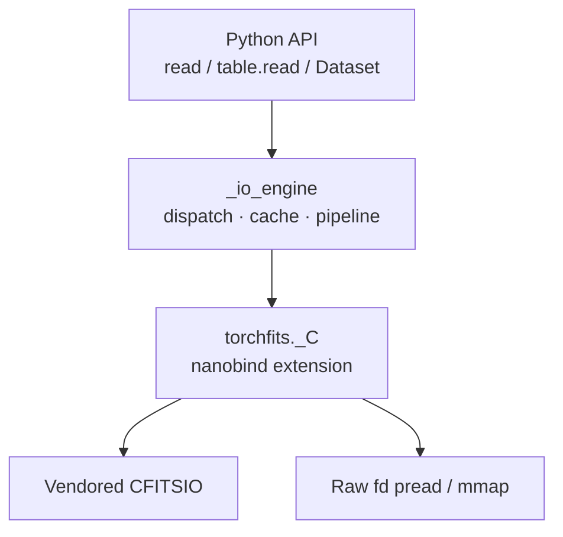
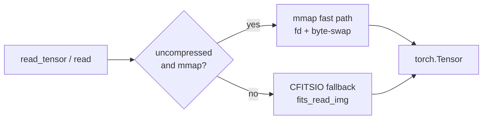
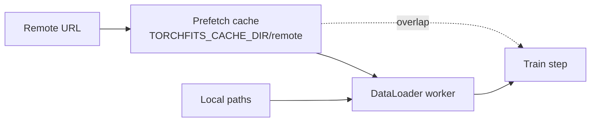

# Architecture

Internal design of torchfits for users who need to understand the C++/Python
layering, I/O paths, caching, and threading model without reading source.
Threading notes reflect **1.0.0rc2+** (private `fitsfile*` per concurrent read;
still current as of rc3).

---

## Layer structure

`io.py` is a thin re-export layer. All real work happens in `_io_engine/`
(submodules: `_read_pipeline.py`, `table_api.py`, `caches.py`) which call
into `torchfits._C`. The C++ extension is compiled via scikit-build-core +
nanobind; it vendors CFITSIO statically.

---

## Image read paths

Three distinct paths, selected automatically:

### 1. mmap fast path (default for uncompressed images)

Used when the image is uncompressed and `mmap=True`.

1. Open raw fd (`O_RDONLY | O_CLOEXEC`)
2. Call `fits_get_hduaddrll` to get the data offset within the file
3. `mmap()` the data region directly — CFITSIO is **not** used for pixel reads
4. Byte-swap in parallel via `at::parallel_for` using `__builtin_bswap16/32/64`
5. Apply BSCALE/BZERO in the same parallel pass or on-device (controlled by
   `scale_on_device`)
6. Return a `torch::Tensor` backed by the mmap region (zero-copy until first
   mutation)

This path bypasses `fits_read_img` entirely. The performance advantage comes
from avoiding CFITSIO's per-row overhead and enabling parallel byte-swapping.

### 2. Signed-byte mmap path

Special case for `BYTE_IMG` with `BSCALE=1, BZERO=-128` (signed byte
convention). After the raw mmap read, applies `_xor_sign_bit_u8` (XOR 0x80
on every byte) in parallel. Faster than arithmetic negation.

### 3. CFITSIO fallback

Used when:

- Image is compressed (`fits_is_compressed_image` returns true)
- File path contains `[` (multi-extension syntax)
- mmap fails or is disabled
- `read_subset` on a compressed image

Calls `fits_read_img` in 128 MB chunks for large images. For compressed
images, CFITSIO handles decompression internally.

---

## Table read paths

### Buffered full-row path

When all selected columns span the full row width, uses `fits_read_tblbytes`
to read entire rows in one call, then unpacks columns in-memory. Fewer I/O
syscalls than per-column reads. Controlled by `TORCHFITS_TABLE_BUFFERED`.

### Column-by-column path

Uses `fits_read_col` per column. Handles VLA, BIT, logical, string, and
complex types with type-specific dispatch. Activated when column selection
doesn't cover the full row, or for types that require special handling.

### mmap table path

Opens raw fd, mmaps the file, uses `fits_get_hduaddrll` for the data offset,
then does parallel byte-swapping on the mmap region. Uses
`posix_madvise(POSIX_MADV_SEQUENTIAL)`. Creates tensor copies (not views).
Activated when `mmap=True` and the table layout permits it.

### Filtered read (predicate pushdown)

`read_columns_mmap_filtered` implements row filtering entirely in C++:

1. mmap the file
2. Pre-byte-swap filter target values to match raw FITS bytes
3. Scan rows in parallel via `at::parallel_for`
4. For EQ/NE on integers: compare raw bytes directly (zero bswap per row)
5. For GT/LT/GE/LE: byte-swap per row then compare

The Python layer (`where.py`) parses the SQL-like `where=` string into
`(column, operator, value)` tuples, which the C++ function consumes.

---

## Caching

Three tiers, all in-process:

### L0 — Per-read `fitsfile*` (CFITSIO R2)

Concurrent reads **do not** share one `fitsfile*` across threads. Each image /
table / subset / HDU-name resolution opens a private handle (`fits_open_diskfile`
/ `fits_open_file`) and closes it when the call (or owning `FITSFile` /
`TableReader`) finishes. That matches CFITSIO User's Guide §2.4 rule R2
(same file, independent handles). The old cross-thread LRU of borrowed
`fitsfile*` pointers was removed for correctness under multi-worker DataLoaders
and multi-HDU concurrent reads.

`UnifiedCache` / `get_or_open_cached` remain available for invalidate/clear
bookkeeping but are **not** on the concurrent read hot path.

### L1 — SharedReadMeta

Per-path shared metadata: image_info, compressed status, scale info, HDU name
resolution, raw fd. Validated via `stat()`. Lives in a global map protected
by per-entry mutexes. Safe to share across threads — maps are mutex-guarded,
and the shared raw `fd` is only used with `pread` (offset-explicit). Avoids
repeated header probing for hot files without sharing CFITSIO CHDU state.

| Env var | Default | Description |
|---|---|---|
| `TORCHFITS_SHARED_META_VALIDATE` | `1` | Enable validation |
| `TORCHFITS_SHARED_META_VALIDATE_INTERVAL_MS` | `1000` | Validation interval |

### L2 — Thread-local metadata

`static thread_local` `LocalHduMeta` map in `read_full_cached`, keyed by
`(meta_uid, hdu)`. Eliminates cross-thread mutex contention in hot loops.
Cleared when exceeding 4096 entries.

---

## Threading model

### GIL release

Every major I/O operation (`read_full`, `read_fits_table`,
`read_fits_table_filtered`, `read_hdus_batch`) releases the GIL during the
CFITSIO/raw-fd call and re-acquires before returning to Python. Safe for
multi-worker DataLoader usage.

HTTP(S) and vos/vault paths on Dataset classes download into the remote cache
(`TORCHFITS_CACHE_DIR` / `TORCHFITS_REMOTE_CACHE`, or `cache_dir=` on the
Dataset). `make_loader(..., optimize_cache=True)` can start prefetch for URLs
in `dataset.files` (skipped for `FitsCutoutDataset`, which prefers HTTP Range
cutouts). Short forms `vos:<user>/...` and `vault:<user>/...` normalize to
`vos://cadc.nrc.ca~vault/<user>/...` via the optional `vos` client.

`read_subset` / CLI `cutout` on **uncompressed 2D** HTTP(S) images Range-fetch
the header plus a contiguous row-band (no full download). Rice / compressed /
scaled remotes still materialize the full file, then use CFITSIO. Remote table
reads use the same full-file cache path (no Range row slices yet). Auth:
`TORCHFITS_HTTP_AUTHORIZATION` or `TORCHFITS_HTTP_TOKEN`.

### Batch image reads

`read_images_batch` spawns one `std::thread` per file (after the first).
Adaptive: if the first read is faster than thread-creation overhead, falls
back to sequential. Each thread opens its own `FITSFile` independently.

### Parallel byte-swapping

All mmap byte-swapping and table column decoding use `at::parallel_for`
(PyTorch's intra-op thread pool). Threshold for parallel sign-bit XOR:
256 KB (`TORCHFITS_XOR_PARALLEL_MIN_BYTES`).

### Handle / metadata thread safety

Each concurrent read owns a private `fitsfile*`. `SharedReadMeta` uses
per-entry `std::mutex`. Thread-local `LocalHduMeta` avoids cross-thread
contention on hot image metadata.

---

## CFITSIO function mapping

### File open/close

`fits_open_file`, `fits_create_file`, `fits_close_file`

### HDU navigation

`fits_movabs_hdu`, `fits_movnam_hdu`, `fits_get_hdu_num`,
`fits_get_num_hdus`, `fits_get_hdu_type`

### Image I/O

`fits_get_img_paramll`, `fits_get_img_dim`, `fits_get_img_size`,
`fits_get_img_type`, `fits_get_img_equivtype`,
`fits_read_img`, `fits_read_pixll`, `fits_read_subset`,
`fits_create_img`, `fits_write_img`

### Table I/O

`fits_get_num_rows`, `fits_get_num_cols`, `fits_get_coltype`,
`fits_read_col`, `fits_read_tblbytes`,
`fits_create_tbl`, `fits_write_col`

### Header I/O

`fits_get_hdrspace`, `fits_read_keyn`, `fits_read_key`,
`fits_update_key`, `fits_write_history`, `fits_write_comment`,
`fits_hdr2str`

### Compression

`fits_is_compressed_image`, `fits_is_compressed_with_nulls` (via `dlsym`),
`fits_set_compression_type`, `fits_set_tile_dim`

### Checksums

`ffpcks` (write), `ffvcks` (verify)

### Metadata / mmap support

`fits_get_hduaddrll` — data offset for raw fd reads,
`fits_set_bscale`, `fits_free_memory`

### Not used: `fits_iterate_data` / CFITSIO `where` / `select_rows`

CFITSIO's iterator (`fits_iterate_data`) streams chunks into a C callback for
whole-image / whole-table scans. torchfits needs **random-access** cutouts
(`fits_read_subset`), full-plane tensors for PyTorch, and Arrow/table pushdown
with our own chunking (`table.scan`). The iterator does not replace those
paths and would add a callback ABI without helping DataLoader or subset
readers — so it is neither wrapped nor benchmarked. Prefer extending
`fits_read_subset` / open-once `SubsetReader` (and cfitsio-direct `cutout_rep`)
for cutout work, and our table scanners for catalogs. For **uncompressed 2D**
images, `SubsetReader` maps the data segment once and copies cutouts with
endian swap (CFITSIO remains the fallback for compressed / scaled / nD).

Likewise, `fits_calculator` / `fits_select_rows` / `fits_find_first_row` are
unused on purpose: torchfits implements its own `where=` grammar and
predicate pushdown (`TableFilter`, mmap-filtered column reads, Arrow
`pc` ops) so projection + compact gather land directly in tensors/Arrow
buffers instead of writing a filtered copy HDU.

Vendored CFITSIO is pinned in `extern/VERSIONS.txt` (currently **4.6.4**).

---

## Data type mapping

| FITS BITPIX | torch dtype | Notes |
|---|---|---|
| 8 (BYTE_IMG) | `int8` | Signed byte convention via BZERO=-128 → XOR 0x80 |
| 16 | `int16` | Byte-swapped from big-endian |
| 32 | `int32` | Byte-swapped |
| 64 | `int64` | Byte-swapped |
| -32 | `float32` | IEEE 754, byte-swapped |
| -64 | `float64` | IEEE 754, byte-swapped |

Unsigned integers (BZERO=32768 for uint16, BZERO=2147483648 for uint32) are
handled by applying the offset rather than promoting to a wider signed type.
This preserves the narrow dtype for GPU transfer.

BSCALE/BZERO and TSCAL/TZERO scaling is applied by torchfits' own C++ code,
not by CFITSIO's internal scaling. This gives control over the exact output
dtype and avoids CFITSIO's float promotion.

---

## Security

`security.h` rejects filenames starting or ending with `|` (pipe character)
to prevent CFITSIO command execution via shell pipes. Leading `!` (overwrite
prefix) is stripped.

---

## Environment variables

This is the canonical list. `docs/api-data.md`, `docs/api-core-io.md`, and
`docs/install.md` link here rather than repeating rows — `tests/test_docs_integrity.py`
enforces that every `TORCHFITS_*` variable actually read by `src/torchfits`
(Python + `cpp_src`) is documented in one of the tables below.

### User-facing

Variables a typical caller sets to point caching at a different disk location.

| Variable | Default | Description |
|---|---|---|
| `TORCHFITS_CACHE_DIR` | `$XDG_CACHE_HOME/torchfits` or `~/.cache/torchfits` | Disk cache root (remotes + samples) |
| `TORCHFITS_REMOTE_CACHE` | `{CACHE_DIR}/remote` | HTTP/vos Dataset prefetch directory |
| `TORCHFITS_SAMPLE_CACHE` | `{CACHE_DIR}/samples` | Example/gallery sample downloads |
| `TORCHFITS_HTTP_TIMEOUT` | `120` | HTTP(S) download / Range timeout (seconds) |
| `TORCHFITS_HTTP_AUTHORIZATION` | unset | Full `Authorization` header value for remotes (wins over `_TOKEN`) |
| `TORCHFITS_HTTP_TOKEN` | unset | Sent as `Authorization: Bearer <token>` when `_AUTHORIZATION` is unset |

### Expert

Performance-tuning knobs. Safe to leave at defaults; documented for people
profiling or working around a specific bottleneck.

| Variable | Default | Description |
|---|---|---|
| `TORCHFITS_CFITSIO_CACHE_FILES` | `32` | CFITSIO open-file cache slots (set together with `_CACHE_MB`) |
| `TORCHFITS_CFITSIO_CACHE_MB` | `256` | CFITSIO open-file cache size in MB |
| `TORCHFITS_TABLE_BUFFERED` | `1` | Enable buffered full-row table reads |
| `TORCHFITS_CACHE_VALIDATE` | `1` | Enable stat()-based validation for residual UnifiedCache bookkeeping (`0` for pure throughput) |
| `TORCHFITS_CACHE_VALIDATE_INTERVAL_MS` | `1000` | UnifiedCache validation interval |
| `TORCHFITS_SHARED_META_VALIDATE` | `1` | Enable SharedReadMeta validation |
| `TORCHFITS_SHARED_META_VALIDATE_INTERVAL_MS` | `1000` | SharedReadMeta validation interval |
| `TORCHFITS_XOR_PARALLEL_MIN_BYTES` | `262144` | Threshold for parallel sign-bit XOR |
| `TORCHFITS_VLA_HEAP_PREAD` | `0` (off) | Contiguous-heap single-`pread` fast path for VLA table columns; off by default until THEAP/offset edge cases are fully proven vs CFITSIO |

### Debug / bench-only

Not for production use — they exist to reproduce bugs or force a code path
during benchmarking.

| Variable | Default | Description |
|---|---|---|
| `TORCHFITS_DEBUG_SCALE` | `0` | Print which BSCALE/BZERO branch `_read_pipeline` took |
| `TORCHFITS_COLD_NOMMAP` | `0` | Force non-mmap image reads |
| `TORCHFITS_COLD_NOCACHE` | `0` | Disable the in-process handle/metadata cache |
| `TORCHFITS_EXAMPLE_FAST` | unset | `examples/` sample-data helper: skip network downloads and fail fast instead (used by CI, `examples/test_examples.py`) |

### Build / docs / bench-only

Not part of the runtime env-var surface; only relevant when building the C++
extension, generating docs, or running the internal benchmark/CANFAR
harnesses. Not enforced by the docs-completeness test above.

- **CMake** (`-DTORCHFITS_...=` at build time): `TORCHFITS_PGO`,
  `TORCHFITS_FINITE_MATH_ONLY`, `TORCHFITS_USE_VENDORED_CFITSIO`,
  `TORCHFITS_AUTO_VENDOR_DEPS`, `TORCHFITS_NIOBUF`, `TORCHFITS_MINDIRECT`.
- **Docs build** (`scripts/build_docs_pages.sh`): `TORCHFITS_DOCS_OUT`,
  `TORCHFITS_DOCS_URL`.
- **Benchmarks** (`scripts/bench_*.sh`): `TORCHFITS_BENCH_ENV`,
  `TORCHFITS_BENCH_GIT`, `TORCHFITS_BENCH_LOG_REDIRECTED`,
  `TORCHFITS_BENCH_MODE`, `TORCHFITS_BENCH_RUN_DIR`, `TORCHFITS_BENCH_RUN_ID`.
- **CANFAR GPU bench launcher** (`scripts/*canfar*.sh`): `TORCHFITS_CANFAR_CPU`,
  `TORCHFITS_CANFAR_EXISTING_SESSION`, `TORCHFITS_CANFAR_FOREGROUND`,
  `TORCHFITS_CANFAR_GPU`, `TORCHFITS_CANFAR_IMAGE`,
  `TORCHFITS_CANFAR_MAX_WAIT_SECS`, `TORCHFITS_CANFAR_MEMORY`,
  `TORCHFITS_CANFAR_NAME`, `TORCHFITS_CANFAR_POLLER`,
  `TORCHFITS_CANFAR_POLL_SECS`.

`TORCHFITS_TORCH_ABI` is a compile-time C++ macro (set by CMake from the
PyTorch build version) — see
[PyTorch ABI compatibility](#pytorch-abi-compatibility) below.

---

## C++ extension surface (`torchfits._C`)

The native module exports the following classes and functions. This surface
is the stability contract — new symbols are private until promoted to
`torchfits.cpp.__all__`.

### Classes

| Class | Purpose |
|---|---|
| `FITSFile` | RAII wrapper around `fitsfile*`. Holds per-handle scale/compressed/image_info caches, raw fd, shared metadata. |
| `SubsetReader` | Reusable RAII reader for repeated cutout access from a single file. |
| `HDUInfo` | Struct: HDU index, type string, header dict. |
| `TableReader` | Column-oriented reader with mmap, buffered, and filtered paths. |

### Image functions

`read_full` (3 overloads), `read_full_cached`, `read_full_nocache`,
`read_full_unmapped`, `read_full_unmapped_raw`, `read_full_raw`,
`read_full_raw_with_scale`, `read_full_scaled_cpu`,
`read_full_numpy`, `read_full_numpy_cached`,
`read_images_batch`, `read_hdus_batch`, `read_hdus_sequence_last`

### Header functions

`read_header`, `read_header_string`, `read_header_dict`,
`resolve_hdu_name_cached`, `get_num_hdus`, `get_hdu_type`

### Table functions

`read_fits_table` (2 overloads), `read_fits_table_from_handle`,
`read_fits_table_rows`, `read_fits_table_rows_from_handle`,
`read_fits_table_rows_numpy`, `read_fits_table_rows_numpy_from_handle`,
`read_fits_table_filtered`,
`write_fits_table`, `append_fits_table_rows`, `insert_fits_table_rows`,
`update_fits_table_rows`, `update_fits_table_rows_mmap`,
`rename_fits_table_columns`, `drop_fits_table_columns`,
`delete_fits_table_rows`

### Write functions

`write_fits_file`, `write_fits_file_compressed_images`,
`write_hdu_checksums`, `verify_hdu_checksums`, `write_hdu_header_cards`

### Cache functions

`configure_cache`, `clear_file_cache`, `invalidate_file_cache`,
`clear_shared_read_meta_cache`, `get_cache_size`

### Utilities

`open_and_read_headers`, `open_fits_file`, `read_tensor_from_handle`,
`echo_tensor`

---

## PyTorch ABI compatibility

The extension performs a runtime check that the PyTorch version prefix
matches `TORCHFITS_TORCH_ABI` (a compile-time constant). Wheels built
against a different PyTorch ABI will fail to load with a clear error
message.
