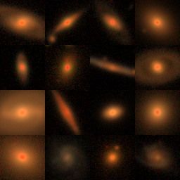
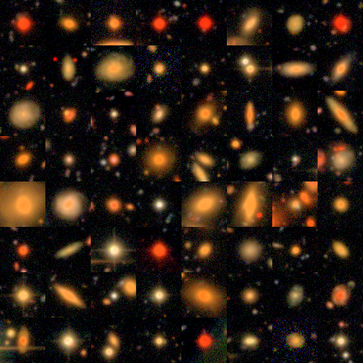

# ML with FITS

User Guide for `torchfits.data`: choose a Dataset, preprocess with
`torchfits.transforms`, load with `make_loader`, train a small model.
API details stay in the [Data module](api-data.md) reference. For a shorter
“which Dataset?” overview, see [Python workflows → Training](python-workflows.md#training-loops).

`make_loader` wraps `torch.utils.data.DataLoader` and can warm the handle
cache when the dataset exposes `.files`. Use a plain `DataLoader` when you
already own `collate_fn` / `persistent_workers`. See
[`example_make_loader_vs_dataloader.py`](published-examples/example_make_loader_vs_dataloader.py).

---

## End-to-end: Galaxy Zoo morphology

Train a tiny CNN on real FITS: Galaxy Zoo 1 labels + Legacy Survey cutouts.

| Step | Source |
|---|---|
| Labels | [Galaxy Zoo 1 DR table2](https://data.galaxyzoo.org/) FITS (`RA`/`DEC`, `SPIRAL`/`ELLIPTICAL`/`UNCERTAIN`) |
| Images | [Legacy Survey `fits-cutout`](https://www.legacysurvey.org/viewer/fits-cutout) `bands=grz`, `size=64` |

```bash
bash scripts/fetch_example_samples.sh   # caches GalaxyZoo1_DR_table2.fits
# first run also downloads ~200 Legacy Survey cutouts (~10–20 MB)
pixi run python examples/example_ml_galaxyzoo_legacy.py
# copy examples/output/ml_gz_class_grid.png → docs/assets/gallery/ when refreshing
```

```python
from torchfits.data import FitsImageDataset, make_loader
from torchfits.transforms import (
    ArcsinhStretch,
    BackgroundSubtract,
    Compose,
    ZScaleNormalize,
)

# labels from GZ1 FITS; paths from Legacy Survey fits-cutout downloads.
# The example prepends NanToZero for off-footprint NaNs before this Compose.
pipeline = Compose(
    [BackgroundSubtract(), ArcsinhStretch(a=0.1), ZScaleNormalize()]
)
dataset = FitsImageDataset(paths, hdu=0, labels=labels, transform=pipeline)
loader = make_loader(dataset, batch_size=16, num_workers=0, optimize_cache=False)

model = TinyCNN()  # two Conv2d + Linear, defined in the example script
optimizer = torch.optim.Adam(model.parameters(), lr=1e-3)
loss_fn = torch.nn.CrossEntropyLoss()

for images, batch_labels in loader:
    optimizer.zero_grad()
    loss = loss_fn(model(images), batch_labels)
    loss.backward()
    optimizer.step()
```

The script runs **one full epoch** on CPU, prints loss / accuracy, and writes
a Lupton RGB sample grid of the cutouts.

1. `table.read` the GZ1 catalog; keep `UNCERTAIN == 0` and spiral or elliptical.
2. Download LS FITS cutouts into `~/.cache/torchfits/samples/gz_legacy_cutouts/`.
3. `FitsImageDataset` + `Compose([NanToZero, BackgroundSubtract, ArcsinhStretch, ZScaleNormalize])`.
4. `make_loader(..., batch_size=16)`.
5. Train `TinyCNN` for one epoch; print metrics.



Script: [`example_ml_galaxyzoo_legacy.py`](published-examples/example_ml_galaxyzoo_legacy.py).
`TORCHFITS_EXAMPLE_FAST=1` skips (exit 0) when cutouts are not cached.

---

## Survey mosaic cutouts: CFHT MegaPipe

Public CFHTLS D1 IQ MegaPipe stacks (~20k×21k float32, ~1.74 GB/band,
**uncompressed**) plus a SExtractor catalog with pixel `X_IMAGE`/`Y_IMAGE`.

```bash
bash scripts/fetch_cfht_megapipe_sample.sh   # ~5.3 GB once
# optional: MEGAPIPE_N_CUTOUTS=50 for a quick local smoke
pixi run python examples/example_megapipe_cutout_collage.py
# copy examples/output/megapipe_cutout_collage.png → docs/assets/gallery/ when refreshing
```

The example:

1. Selects 64 gallery stamps with `MAG_AUTO ∈ [17, 22]`.
2. Reads matching G/R/I windows with `open_subset_reader`.
3. Builds Lupton RGB (`Q=8`, `stretch=5`) into an 8×8 collage (512×512).
4. Times 1000 random 64×64 boxes (one subprocess per backend; setup+warm
   outside the timer; peers force owned copies).

Indicative timing on this machine (1000×64×64, G band, uncompressed float32):

| Backend | Wall | ms/cutout |
|---|---:|---:|
| `torchfits.open_subset_reader` | 0.060 s | 0.060 |
| astropy (`memmap` + copy) | 0.149 s | 0.149 |
| `torchfits.read_subset` | 0.165 s | 0.165 |
| fitsio | 0.297 s | 0.297 |

`open_subset_reader` maps the uncompressed data segment once and does
row slice + endian swap into a torch tensor — same class of work as fitsio /
Astropy memmap cutouts, including FITS integer conventions (``uint16`` /
signed-byte ``BZERO``). CFITSIO remains the fallback for compressed, arbitrary
``BSCALE``/``BZERO``, or non-2D HDUs. Prefer it over repeated `read_subset` for
many windows from one mosaic. Rice `.fz` / full-HDU / GPU numbers stay on the
[scorecards](benchmarks.md).



Script: [`example_megapipe_cutout_collage.py`](published-examples/example_megapipe_cutout_collage.py).

---

## Choosing a Dataset

| Class | Use when |
|---|---|
| `FitsImageDataset` | 2D IMAGE HDUs / multi-band stacks as `[C,H,W]` |
| `FitsCubeDataset` | 3D+ cubes with optional `slice_index` |
| `FitsSpectrumDataset` | 1D spectra or DESI-style multi-arm layouts |
| `FitsTableDataset` | Catalog rows as features / labels |
| `FitsCutoutDataset` | Many pixel windows from one or more mosaics |
| `Fits*IterableDataset` | 100k+ files; streaming iterable shards |

Full signatures: [Data module](api-data.md).

---

## Related scripts

| Script | Role |
|---|---|
| [`example_image_dataset.py`](published-examples/example_image_dataset.py) | Minimal `FitsImageDataset` + `make_loader` |
| [`example_data_catalogs.py`](published-examples/example_data_catalogs.py) | Table + cutout datasets |
| [`example_custom_transform.py`](published-examples/example_custom_transform.py) | Subclass `FITSTransform` |
| [`example_make_loader_vs_dataloader.py`](published-examples/example_make_loader_vs_dataloader.py) | Warm-up vs plain `DataLoader` |
