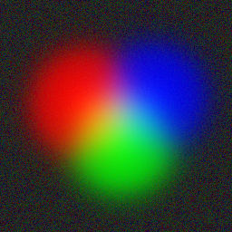

# Transform gallery

Before/after figures from the gallery scripts. API formulas:
[Transforms reference](api-transforms.md). Short Compose demo:
[`example_transforms.py`](published-examples/example_transforms.py).

```bash
pixi run python examples/gallery_images.py
pixi run python examples/gallery_spectra.py
pixi run python examples/gallery_tables_lc.py
# copy selected PNGs into docs/assets/gallery/ when refreshing the site
```

Public samples download once into `~/.cache/torchfits/samples/`.
`TORCHFITS_EXAMPLE_FAST=1` uses synthetic fallbacks when the cache is empty.

Use a **tensor** variable from `read_tensor` (IMAGE HDU payload), not an
undefined `image` name.

---

## Tensors (HorseHead)

Astropy-style open → stretch / normalize → inspect.

```python
import torchfits
from torchfits.transforms import (
    ArcsinhStretch,
    ZScaleNormalize,
    Compose,
    BackgroundSubtract,
)

tensor = torchfits.read_tensor("horsehead.fits", hdu=0)
arcsinh = ArcsinhStretch(a=0.1)(tensor)
zscale = ZScaleNormalize()(tensor)
pipeline = Compose(
    [BackgroundSubtract(), ArcsinhStretch(a=0.1), ZScaleNormalize()]
)
out = pipeline(tensor)
```


Stretches that look identical on a flat field are expected — HorseHead has
limited dynamic range in some panels; prefer Arcsinh / Log / ZScale for
visible differences.

---

## Spectra and continuum

`gallery_spectra.py` runs on the real SDSS DR16 fiber spectrum
(`sdss_spectrum`, fetched via `bash scripts/fetch_example_samples.sh`) when
cached, falling back to a synthetic spectrum with strong absorption/emission
lines otherwise so continuum remove vs normalize stays visually obvious
either way.

```python
from torchfits.transforms import ContinuumNormalize, ContinuumRemoval, DopplerShift

# flux: 1D tensor; wave: wavelength grid (Angstrom)
normed = ContinuumNormalize()(flux)
residual = ContinuumRemoval()(flux)
shifted = DopplerShift(velocity_kms=100.0)(flux, wavelength=wave)
```


---

## Tables / light curves

```python
from torchfits.transforms import SigmaClip1D, SavitzkyGolayFilter

clean = SigmaClip1D(sigma=3.0)(flux)
smoothed = SavitzkyGolayFilter(window_length=11, polyorder=2)(flux)
```


## Lupton asinh RGB

`lupton_rgb(i, r, g, Q=10.0, stretch=0.5)` on real reprojected SDSS g/r/i
cutouts (Astropy's reddest-to-R convention). The samples ship as `.fits.bz2`;
most CFITSIO builds don't decompress bzip2, so the example inflates each
band to a temp `.fits` file with the stdlib `bz2` module before reading:

```python
from torchfits.transforms import lupton_rgb

rgb = lupton_rgb(i, r, g, Q=10.0, stretch=0.5)
```

Script: [`example_lupton_rgb_sdss.py`](published-examples/example_lupton_rgb_sdss.py)
(fetch samples via `bash scripts/fetch_example_samples.sh`).

### CLI RGB demo

Three synthetic bands → Lupton RGB (use distinct `--bands` values for a
real color check without network samples):



```bash
pixi run python examples/cli/make_rgb_demo.py docs/assets/gallery
```
