# Transform gallery

Before/after figures from the gallery scripts. API formulas:
[Transforms reference](api-transforms.md). Short Compose demo:
[`example_transforms.py`](published-examples/example_transforms.py).

```bash
pixi run python examples/gallery_images.py
pixi run python examples/gallery_spectra.py
pixi run python examples/gallery_tables_lc.py
# copy selected PNGs into docs/assets/gallery/ when refreshing the site
```

Public samples download once into `~/.cache/torchfits/samples/`.
`TORCHFITS_EXAMPLE_FAST=1` uses synthetic fallbacks when the cache is empty.

---

## Images (HorseHead)

Astropy-style open → stretch / normalize → inspect.

```python
from torchfits.transforms import ArcsinhStretch, ZScaleNormalize, Compose, BackgroundSubtract

arcsinh = ArcsinhStretch(a=0.1)(image)
zscale = ZScaleNormalize()(image)
pipeline = Compose([BackgroundSubtract(), ArcsinhStretch(a=0.1), ZScaleNormalize()])
```

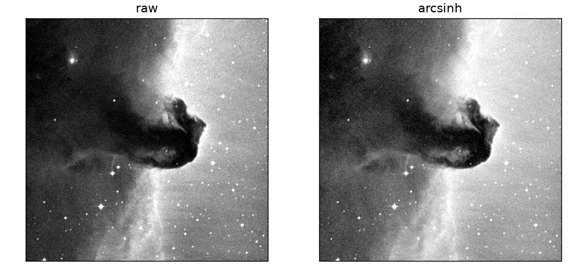


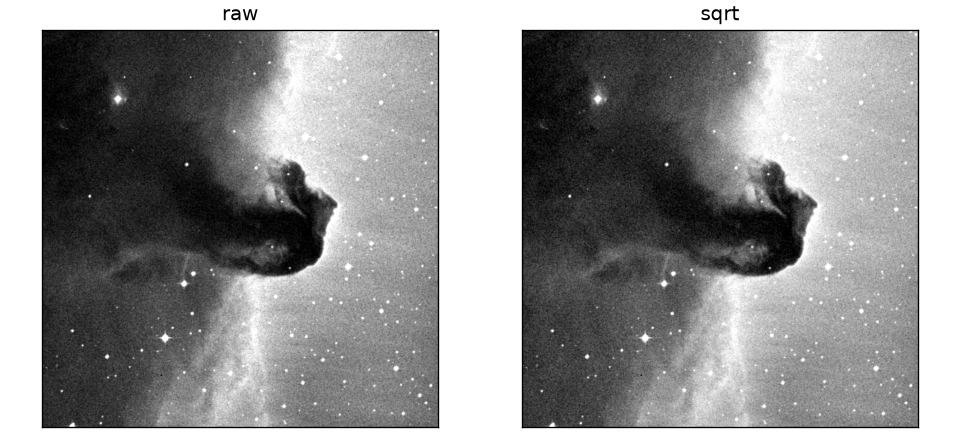


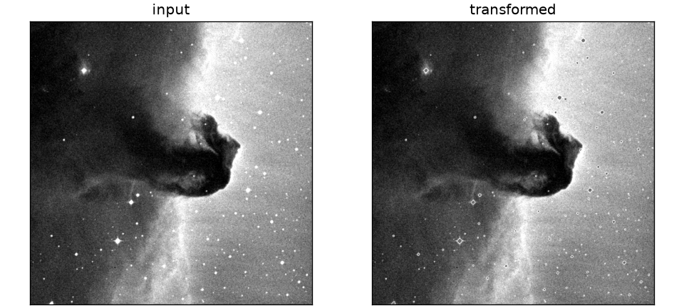


Also generated by `gallery_images.py`: `MinMaxNormalize`,
`PercentileClipNormalize`, `GlobalScalarNorm`, `AsymmetricSigmaClip`,
`FITSHeaderNormalize`.

---

## Spectra and continuum

```python
from torchfits.transforms import ContinuumNormalize, ContinuumRemoval, DopplerShift

normed = ContinuumNormalize()(flux)
residual = ContinuumRemoval()(flux)
shifted = DopplerShift(velocity_kms=100.0)(flux, wavelength=wave)
```

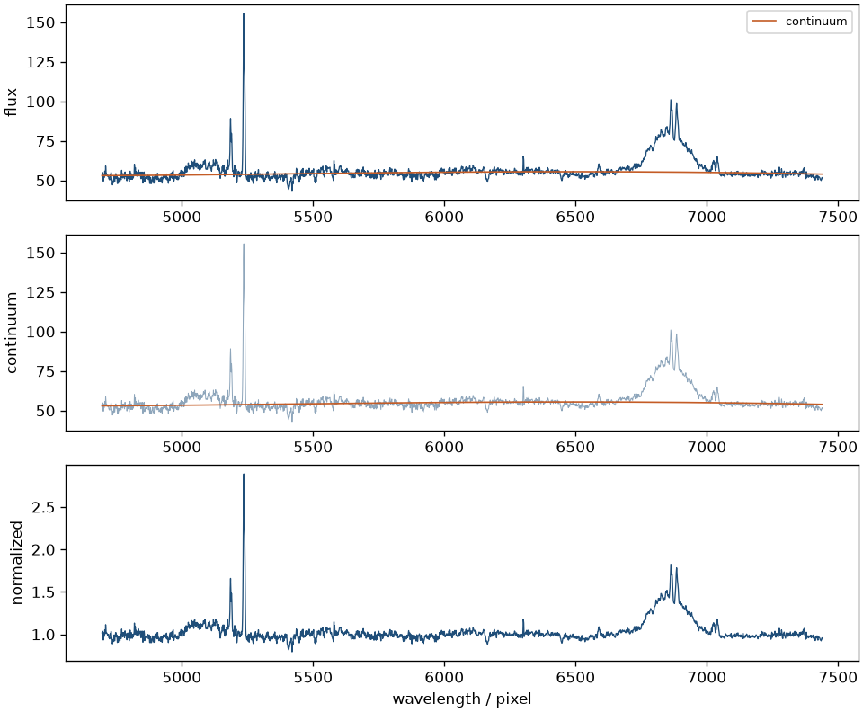

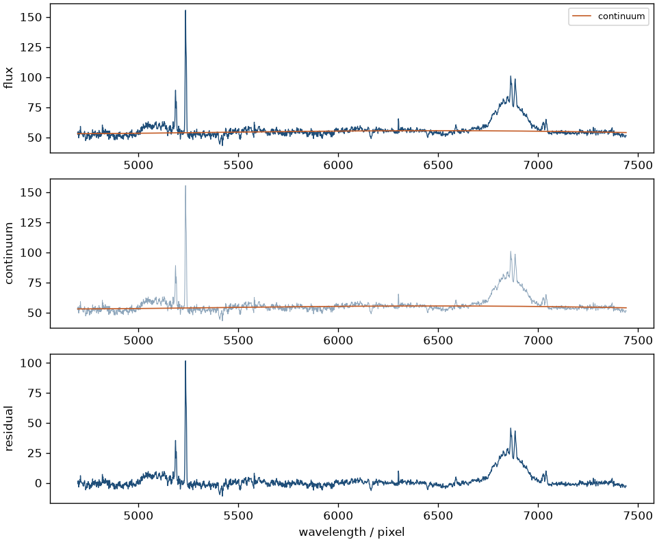

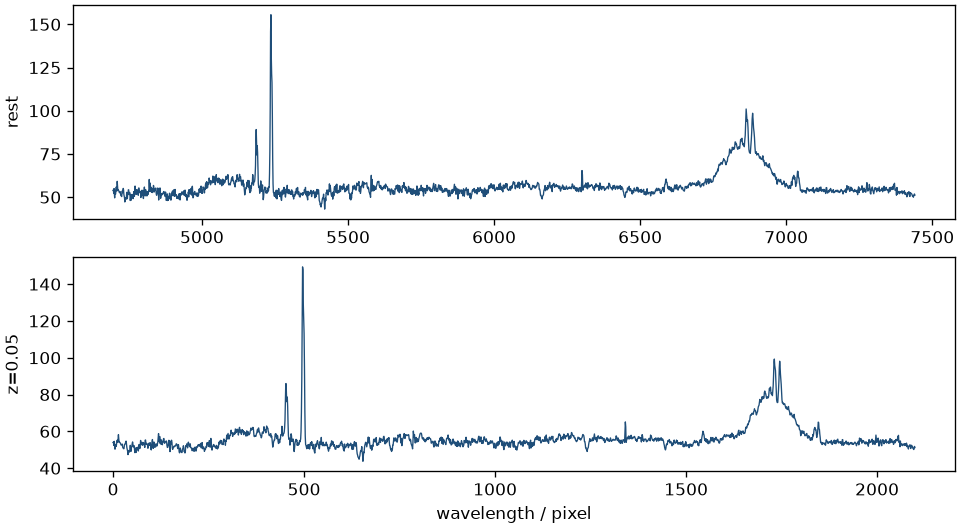

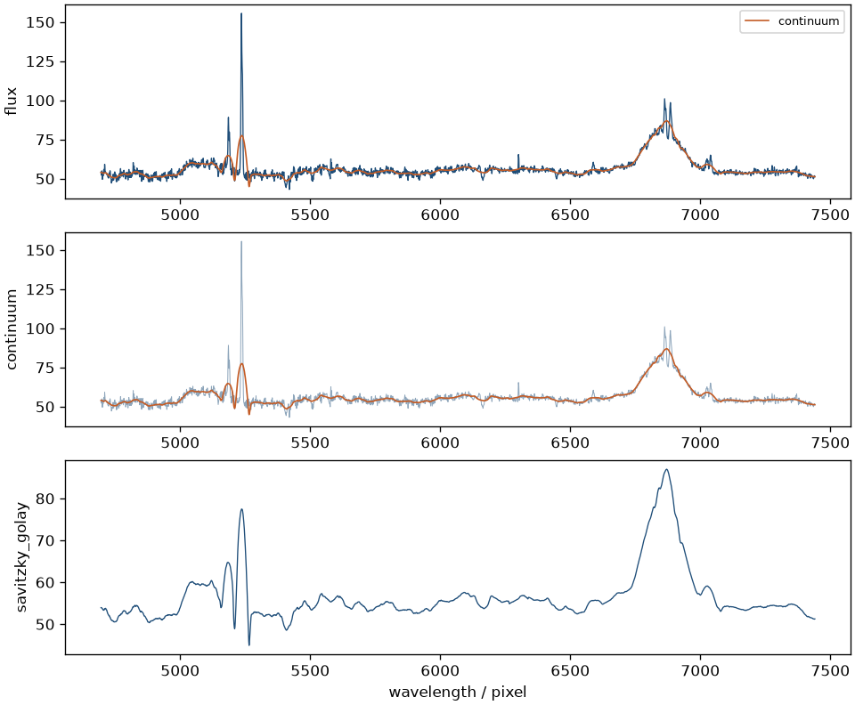

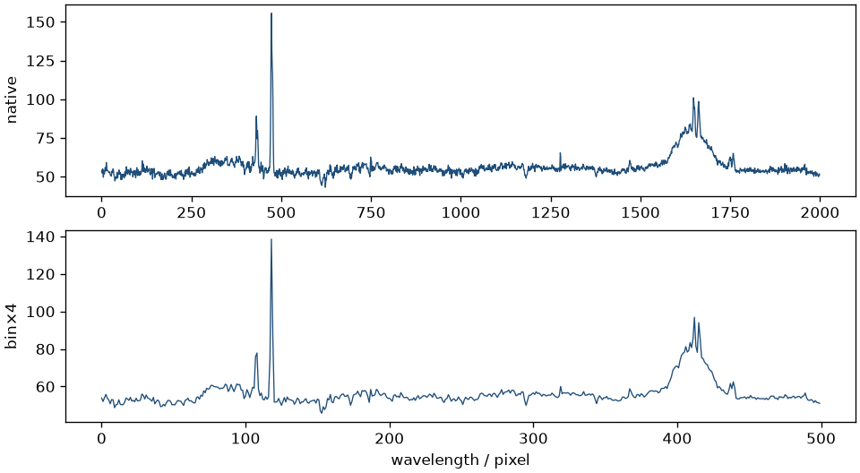

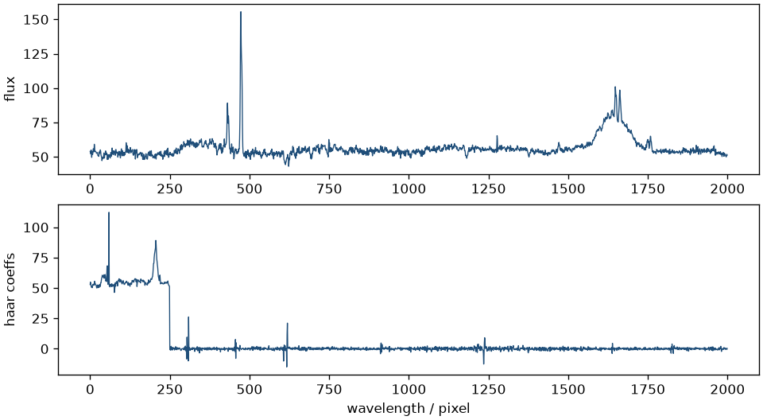

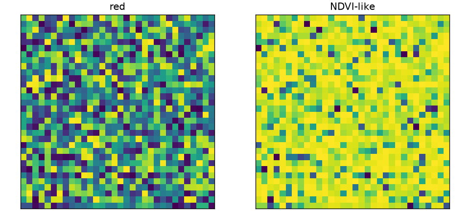

!!! note "SpectralBinning limits"
    Adjacent-channel mean/sum — not full flux-conserving resample onto an
    arbitrary wavelength grid.

---

## Light curves and tables

```python
from torchfits.transforms import PhaseFold, SigmaClip, FITSScaleColumns

folded = PhaseFold(period=3.0)(time, flux)
clipped = SigmaClip(n_sigma=3.0)(flux)
```

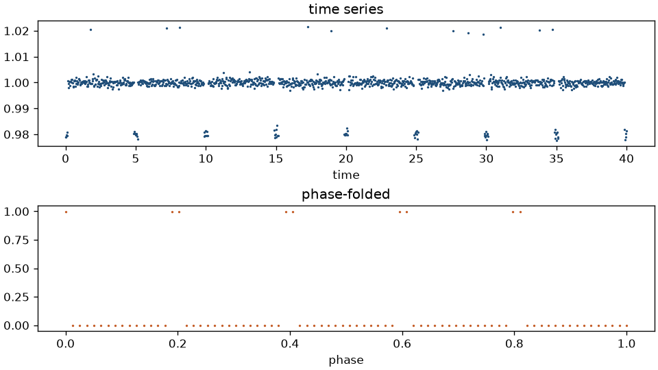

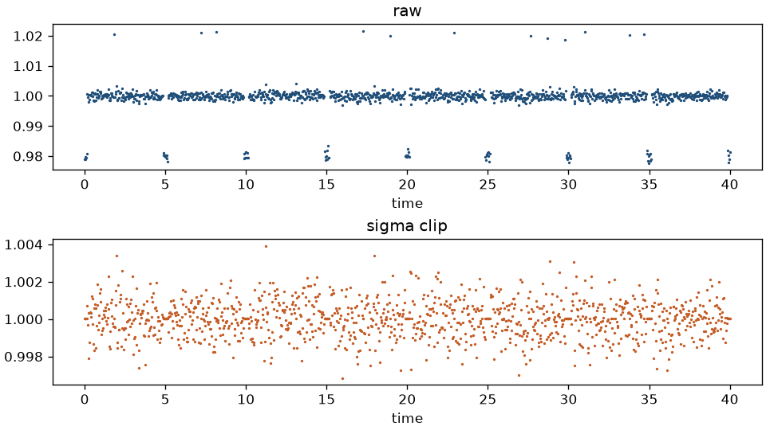

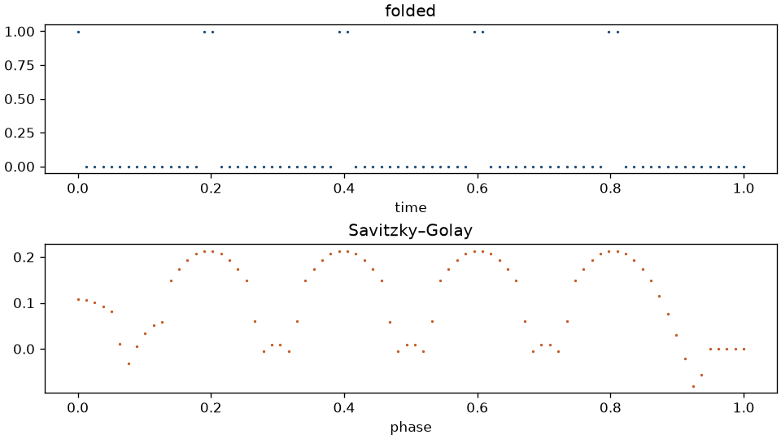

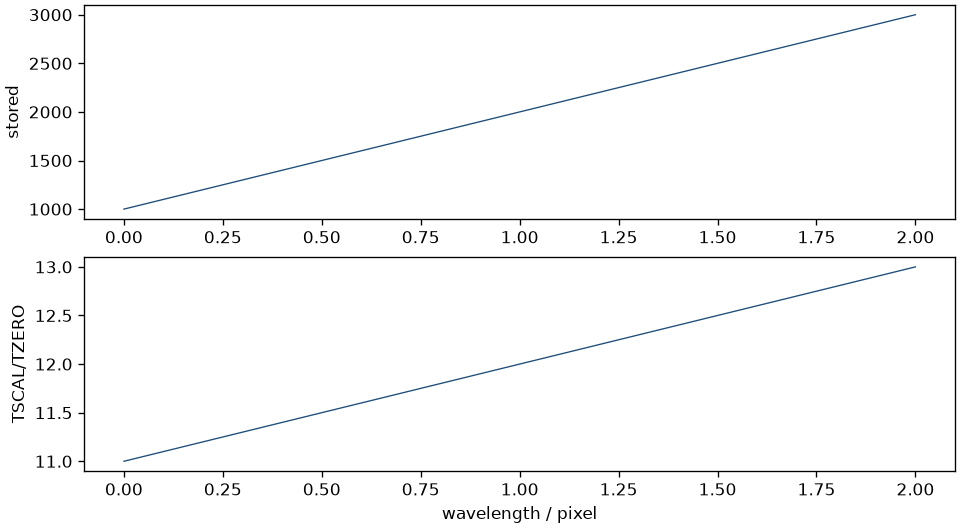

---

## Cubes

[`example_hyperspectral.py`](published-examples/example_hyperspectral.py) covers
multi-band cubes (binning, continuum, band math) with optional figures under
`examples/output/`.
