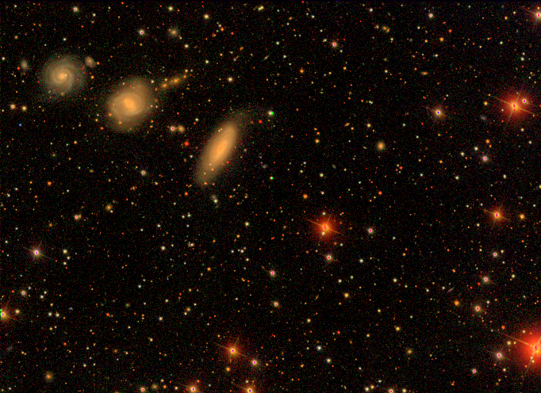

# Transform gallery

Curated before/after figures. Full API:
[Transforms reference](api-transforms.md). Compose smoke test:
[`example_transforms.py`](published-examples/example_transforms.py).

```bash
pixi run python examples/gallery_images.py
pixi run python examples/gallery_spectra.py
pixi run python examples/gallery_tables_lc.py
# copy only the allowlisted PNGs below into docs/assets/gallery/
```

**Gallery PNG allowlist** (copy from `examples/output/` when refreshing):

- `image_compose_pipeline.png`
- `spectrum_continuum_normalize.png`, `spectrum_continuum_removal.png`, `spectrum_doppler_shift.png`
- `lightcurve_sigma_clip.png`, `lightcurve_savgol_folded.png`
- `table_fits_scale_columns.png`
- `lupton_rgb_sdss.png` (from `example_lupton_rgb_sdss.py`)

Public samples: `bash scripts/fetch_example_samples.sh`.
`TORCHFITS_EXAMPLE_FAST=1` uses synthetic fallbacks for the gallery scripts
when the cache is empty; `example_lupton_rgb_sdss.py` skips cleanly instead.

---

## Image pipeline (Compose)

HorseHead alone has limited stretch contrast; the useful story is a
**Compose** of background → arcsinh → zscale:

```python
import torchfits
from torchfits.transforms import (
    ArcsinhStretch,
    BackgroundSubtract,
    Compose,
    ZScaleNormalize,
)

tensor = torchfits.read_tensor("horsehead.fits", hdu=0)
pipeline = Compose(
    [BackgroundSubtract(), ArcsinhStretch(a=0.1), ZScaleNormalize()]
)
out = pipeline(tensor)
```


Script: [`example_transforms.py`](published-examples/example_transforms.py).
Cutouts live under [Examples → Cutout](examples.md#cutout), not here.

---

## Spectra and continuum

`gallery_spectra.py` uses the real SDSS DR16 fiber (`sdss_spectrum`) when
cached, else a synthetic spectrum with strong lines.

```python
from torchfits.transforms import ContinuumNormalize, ContinuumRemoval, DopplerShift

normed = ContinuumNormalize()(flux)
residual = ContinuumRemoval()(flux)
shifted = DopplerShift(z=0.05)(flux)
```


---

## Tables / light curves

```python
from torchfits.transforms import SigmaClip1D, SavitzkyGolayFilter

clean = SigmaClip1D(sigma=3.0)(flux)
smoothed = SavitzkyGolayFilter(window_length=11, polyorder=2)(flux)
```


---

## Lupton asinh RGB (real SDSS)

`lupton_rgb` matches Astropy's Lupton asinh mapping (per-pixel peak clip —
never a field-wide `/max`, which crushed midtones to near-black). On this
reprojected SDSS g/r/i sample the object fluxes are faint, so the gallery
uses `Q=8, stretch=0.15` (Astropy's default stretch is `5`; tutorials often
use `0.5`). Reddest band → R:

```python
from torchfits.transforms import lupton_rgb

rgb = lupton_rgb(i, r, g, Q=8.0, stretch=0.15)
```



Script: [`example_lupton_rgb_sdss.py`](published-examples/example_lupton_rgb_sdss.py).

CLI synthetic RGB (no network) is under [CLI recipes](cli-recipes.md).
