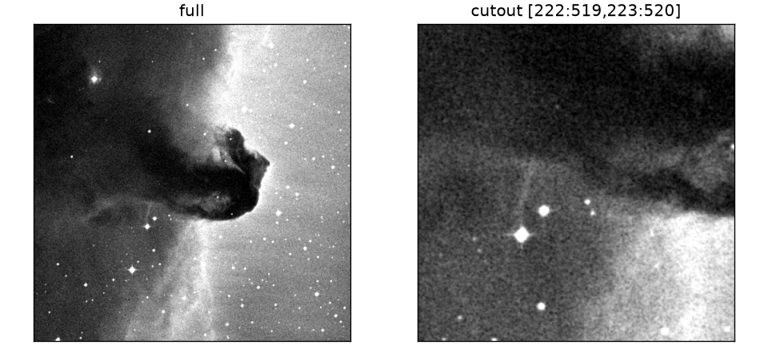
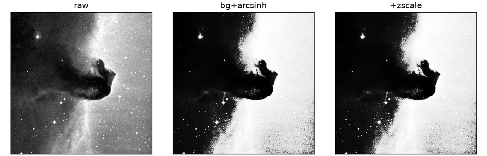

# Examples

Short worked examples with real outputs. Full scripts live under
[`published-examples/`](published-examples/README.md). Smoke suite:

```bash
pixi run python examples/test_examples.py
```

| Layer | Use when |
|---|---|
| `read_tensor` / `table.read` | One file, inspect, write |
| `torchfits.transforms` | Reusable viz / model preprocess |
| `Fits*Dataset` + `make_loader` | Many files/rows as a training loop |

## Scope

torchfits reads and writes FITS: IMAGE HDUs → tensors, table HDUs →
dataframes (Arrow / Polars / tensor columns), plus `torchfits.data` for
training loops. WCS reprojection, source detection, and photometry remain in
Astropy / photutils / reproject. Several examples follow an Astropy or survey
tutorial through FITS I/O, then return tensors or arrays for WCS math
elsewhere.

## Sample sources

Most examples run against public tutorial and survey files, fetched once
into `~/.cache/torchfits/samples/` (or CFHT MegaCam data into
`benchmarks_data/cfht_megacam/`):

```bash
bash scripts/fetch_example_samples.sh              # astropy tutorial samples
bash scripts/fetch_example_samples.sh --with-manga  # + ~200MB MaNGA LOGCUBE
bash scripts/fetch_cfht_megacam_sample.sh           # CFHT MegaCam MEF (CADC)
bash scripts/fetch_cfht_megapipe_sample.sh          # CFHTLS MegaPipe mosaics (~5.3 GB)
```

`TORCHFITS_EXAMPLE_FAST=1` (set in CI) skips downloads and uses synthetic
fallbacks or a clean `SKIP:` exit where no fallback exists.

| Source | Sample(s) | Script |
|---|---|---|
| Learn Astropy — FITS images (HorseHead) | `horsehead` | [`example_image.py`](published-examples/example_image.py), [`example_image_cutouts.py`](published-examples/example_image_cutouts.py) |
| Learn Astropy — M13 blue frame stacking | `m13_blue_0001..5` | [`example_m13_stack.py`](published-examples/example_m13_stack.py) |
| Learn Astropy — FITS-Header (MEF) | `fits_header_mef` | [`example_mef_header.py`](published-examples/example_mef_header.py) |
| Learn Astropy — FITS tables (Chandra events) | `chandra_events` | [`example_table.py`](published-examples/example_table.py) |
| Learn Astropy — FITS cubes | `radio_cube_c14` | [`example_image_cube.py`](published-examples/example_image_cube.py) |
| Astropy photometry tutorial | `spitzer_example` | [`example_cutout_wcs_write.py`](published-examples/example_cutout_wcs_write.py) |
| Astropy visualization — reprojected SDSS g/r/i | `sdss_lupton_g/r/i` | [`example_lupton_rgb_sdss.py`](published-examples/example_lupton_rgb_sdss.py) |
| SDSS DR16 spectrum | `sdss_spectrum` | [`gallery_spectra.py`](published-examples/gallery_spectra.py) |
| SDSS MaNGA DR17 LOGCUBE | `manga_logcube` | [`example_manga_logcube.py`](published-examples/example_manga_logcube.py) |
| CFHT MegaCam (CADC) | MEF `.fits.fz` exposures | [`example_megacam_mef_cutouts.py`](published-examples/example_megacam_mef_cutouts.py) |
| Galaxy Zoo 1 + Legacy Survey cutouts | `galaxy_zoo1_table2` + LS FITS stamps | [`example_ml_galaxyzoo_legacy.py`](published-examples/example_ml_galaxyzoo_legacy.py) |
| CFHT MegaPipe D1 IQ mosaics | `benchmarks_data/cfht_megapipe/` | [`example_megapipe_cutout_collage.py`](published-examples/example_megapipe_cutout_collage.py) |

---

## Read a tensor (IMAGE HDU)

```python
import torchfits

tensor = torchfits.read_tensor("image.fits", hdu=0)
header = torchfits.read_header("image.fits", hdu=0)
print(tensor.shape, tensor.dtype)
print(header["OBJECT"], header["BITPIX"])
```

```text
torch.Size([8, 8]) torch.float32
M31 -32
```

Script: [`example_image.py`](published-examples/example_image.py).

---

## Filter a table

```python
df = torchfits.table.read(
    "catalog.fits",
    hdu=1,
    columns=["ra", "dec", "flux"],
    where="flux >= 2.0",
)
cols = torchfits.table.read_torch("catalog.fits", hdu=1, columns=["ra", "flux"])
print(df.num_rows, df.column("flux").to_pylist())
print(cols["ra"].tolist())
```

```text
2 [2.0, 3.0]
[200.0, 201.0, 202.0]
```

Script: [`example_table.py`](published-examples/example_table.py), which also
filters the real Chandra events table (`energy > 5000`) when cached.

---

## Cutout

torchfits `--box` is 0-based half-open. CFITSIO sections on the path also work
(1-based inclusive).

```python
cut = torchfits.read_subset("horsehead.fits", 0, 100, 100, 356, 356)
print(cut.shape, float(cut.float().mean()))
```

```text
torch.Size([256, 256]) 8402.0
```

```bash
torchfits cutout horsehead.fits cutout.fits --box 100,100,356,356
torchfits info cutout.fits --hdu 0
```

```text
dtype='int16' file='cutout.fits' hdu=0 name='PRIMARY' shape='(256, 256)' type='IMAGE'
```



Script: [`example_image_cutouts.py`](published-examples/example_image_cutouts.py).

---

## Transforms

Stretch / normalize for viz or model input. Skip when you need raw stored values.

```python
from torchfits.transforms import ArcsinhStretch, BackgroundSubtract, Compose, ZScaleNormalize

pipeline = Compose([BackgroundSubtract(), ArcsinhStretch(a=0.1), ZScaleNormalize()])
out = pipeline(tensor)
restored = pipeline.inverse(out)
```



Full gallery (continuum, Lupton RGB, LC): [Transform gallery](examples-transforms.md).
Script: [`example_transforms.py`](published-examples/example_transforms.py).
Custom subclass: [`example_custom_transform.py`](published-examples/example_custom_transform.py).

---

## Datasets / training

User Guide walkthrough (Galaxy Zoo + Legacy Survey FITS cutouts, MegaPipe
collage, `make_loader` vs `DataLoader`): [ML with FITS](examples-ml.md).

API reference: [Data module](api-data.md).

---

## CLI on real data (HorseHead)

```bash
torchfits info horsehead.fits --hdu 0
torchfits stats horsehead.fits --hdu 0 --format jsonl
```

```text
dtype='int16' file='horsehead.fits' hdu=0 name='PRIMARY' shape='(893, 891)' type='IMAGE'
{"hdu": 0, "name": "PRIMARY", "shape": [893, 891], "dtype": "int16",
 "min": 3759.0, "max": 22918.0, "mean": 9831.48}
```

Recipes: [CLI recipes](cli-recipes.md). Shell demo:
[`cli/imstat_imarith.sh`](published-examples/cli/imstat_imarith.sh).

---

## More scripts

### Arrays and tensors

| Script | Demonstrates |
|---|---|
| [`example_image.py`](published-examples/example_image.py) | read / write round-trip |
| [`example_image_cutouts.py`](published-examples/example_image_cutouts.py) | `read_subset`, `open_subset_reader` |
| [`example_image_cube.py`](published-examples/example_image_cube.py) | 3D cubes |
| [`example_image_mef.py`](published-examples/example_image_mef.py) | MEF `open` / `read_hdus` |
| [`example_m13_stack.py`](published-examples/example_m13_stack.py) | stack multiple exposures into a mean image |
| [`example_mef_header.py`](published-examples/example_mef_header.py) | inspect a multi-extension header by EXTNAME |
| [`example_cutout_wcs_write.py`](published-examples/example_cutout_wcs_write.py) | cutout + `CRPIX*` translation on write-back |
| [`example_lupton_rgb_sdss.py`](published-examples/example_lupton_rgb_sdss.py) | Lupton asinh RGB from real SDSS g/r/i; decompresses `.fits.bz2` via stdlib `bz2` (CFITSIO builds commonly lack bzip2 support) |
| [`example_manga_logcube.py`](published-examples/example_manga_logcube.py) | named HDUs (`FLUX`/`IVAR`/`MASK`/`WAVE`); axis order is `(wave, y, x)` |
| [`example_megacam_mef_cutouts.py`](published-examples/example_megacam_mef_cutouts.py) | cutouts from a real CFHT MegaCam MEF; fetch via `bash scripts/fetch_cfht_megacam_sample.sh` |

### Tables

| Script | Demonstrates |
|---|---|
| [`example_table.py`](published-examples/example_table.py) | Arrow dataframe, tensors, mutations |
| [`example_table_interop.py`](published-examples/example_table_interop.py) | Pandas / Arrow / Polars |
| [`example_polars.py`](published-examples/example_polars.py) | `read_polars` / `scan_polars` |
| [`example_table_recipes.py`](published-examples/example_table_recipes.py) | scanner, DuckDB |

### Training / spectra / time series

| Script | Demonstrates |
|---|---|
| [`example_hyperspectral.py`](published-examples/example_hyperspectral.py) | cube transforms |
| [`example_time_series.py`](published-examples/example_time_series.py) | phase fold, sigma clip |
| [`example_custom_transform.py`](published-examples/example_custom_transform.py) | subclassing `FITSTransform`, `Compose`, Dataset wiring |
| [`example_make_loader_vs_dataloader.py`](published-examples/example_make_loader_vs_dataloader.py) | `make_loader` vs plain `DataLoader` |
| [`example_ml_galaxyzoo_legacy.py`](published-examples/example_ml_galaxyzoo_legacy.py) | GZ1 labels + Legacy Survey FITS cutouts → Dataset → tiny CNN ([ML guide](examples-ml.md)) |
| [`example_megapipe_cutout_collage.py`](published-examples/example_megapipe_cutout_collage.py) | MegaPipe mosaic cutouts + Lupton collage + timing ([ML guide](examples-ml.md)) |

### Figure generators

| Script | Output |
|---|---|
| [`gallery_images.py`](published-examples/gallery_images.py) | image before/after PNGs |
| [`gallery_spectra.py`](published-examples/gallery_spectra.py) | continuum / Doppler plots |
| [`gallery_tables_lc.py`](published-examples/gallery_tables_lc.py) | light-curve plots |

Samples cache under `~/.cache/torchfits/samples/`. CI sets
`TORCHFITS_EXAMPLE_FAST=1` to skip downloads.
